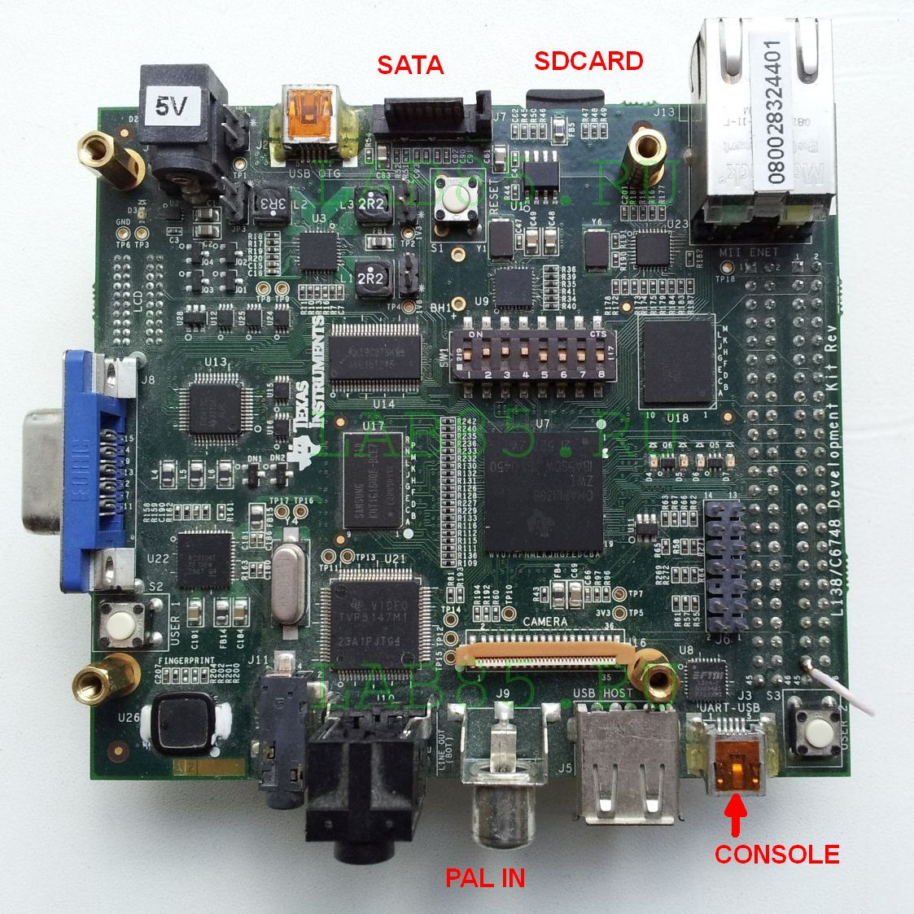

Board TI OMAP L138 LCDK.

Test prj: Record PAL(720x576) encode video to HDD.
Video encode H264 or MPEG4.

[https://lab85.ru](https://www.lab85.ru/index.php/laboratoriya-stati/55-omap-l138-test-proizvoditelnosti-video-kodekov-h264-i-mpeg4)

